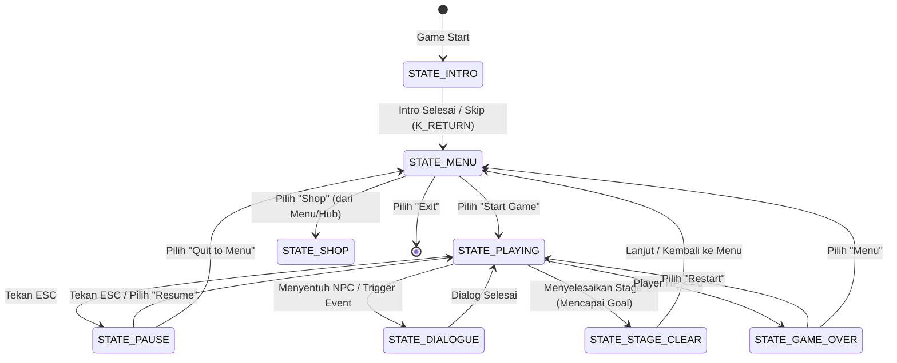

# Rencana Pengembangan Arsitektur Game & UI Platformer Pixel Art (16x16px)

Dokumen ini berisi rancangan teknis dan rencana implementasi sistem UI, scaling resolusi, serta State Machine untuk game platformer 2D berbasis Pixel Art 16x16px menggunakan Pygame.

---

## 1. Arsitektur Resolusi & Scaling (Pixel Perfect)

Untuk mendapatkan tampilan pixel art yang tajam (tidak buram/blur) dan konsisten, game menggunakan metode **Double Buffering Surface** dengan pembagian sebagai berikut:

| Parameter | Resolusi | Fungsi |
| :--- | :--- | :--- |
| **Logical Display (`self.display`)** | `400 x 300` px | Kanvas utama untuk menggambar semua sprite 16x16px dan UI Pixel Art. Semua kalkulasi koordinat game (posisi pemain, kamera, dll.) berada pada resolusi ini. |
| **Physical Window (`self.screen`)** | `800 x 600` px | Jendela aktual sistem operasi. `self.display` akan di-scale sebesar 2x secara presisi menggunakan `pygame.transform.scale()` lalu digambar ke sini. |

### Aturan Menggambar UI (Menghindari Kekecilan & Over Frame)
1. **Rendering Terpadu di `self.display`**: Seluruh elemen UI (HUD, Dialog Box, Menu) digambar langsung ke `self.display` terlebih dahulu, bukan ke `self.screen`. Hal ini menjamin UI ikut membesar secara proporsional (2x) bersama game, mencegah UI terlihat kekecilan.
2. **Penggunaan Font Pixel**: Menggunakan font khusus pixel art (misal: *Press Start 2P* atau *Monospace*) dengan ukuran yang pas untuk canvas `400x300` (biasanya ukuran 8px hingga 16px).
3. **Sistem Anchor UI**: Penempatan elemen UI menggunakan sistem koordinat relatif terhadap `DISPLAY_WIDTH` (`400`) dan `DISPLAY_HEIGHT` (`300`):
   - **HUD HP & XP**: Pojok kiri atas -> `(10, 10)` dengan lebar maksimum `120` px.
   - **Dialog Box**: Bagian bawah tengah -> `(20, DISPLAY_HEIGHT - 80)` dengan ukuran `360 x 70` px.
   - **Pause / Menu Card**: Tengah layar -> `(DISPLAY_WIDTH // 2 - 80, DISPLAY_HEIGHT // 2 - 60)` dengan ukuran `160 x 120` px.

---

## 2. Alur Transisi State (State Machine)

Berikut adalah diagram transisi antar-state dalam game:



---

## 3. Rencana Eksekusi: Input, Proses, & Output (IPO) per State

### A. STATE_INTRO (Loading / Splash Screen)
*   **Input**:
    *   Keyboard: `K_RETURN` / `K_SPACE` (untuk skip intro).
    *   Waktu: Durasi otomatis (misal 3 detik).
*   **Proses**:
    *   Menghitung durasi penampilan logo pengembang.
    *   Membuat efek fade-in dan fade-out pada logo menggunakan manipulasi alpha channel di Pygame.
    *   Menginisialisasi resource game dasar di background.
*   **Output**:
    *   Visual: Animasi logo/tulisan "PRESENTS" yang memudar halus di tengah layar.
    *   Transisi: Berpindah otomatis ke `STATE_MENU`.

### B. STATE_MENU (Main Menu)
*   **Input**:
    *   Keyboard: Tombol Arah (`K_UP`, `K_DOWN` atau `K_w`, `K_s`) untuk navigasi opsi menu; `K_RETURN` / `K_SPACE` untuk konfirmasi pilihan.
*   **Proses**:
    *   Mengatur indeks menu aktif (`selected_index`).
    *   Memproses pilihan menu:
        1. **Start**: Menginisialisasi game baru / memuat level.
        2. **Shop**: Mengalihkan ke State Shop.
        3. **Exit**: Memanggil `pygame.quit()` dan `sys.exit()`.
*   **Output**:
    *   Visual: Judul game beranimasi (sinusoidal floating), daftar tombol/opsi menu dengan kursor penunjuk (misal tanda `>` atau ikon kecil) yang berkedip.
    *   Audio: Sound effect (SFX) saat memindahkan kursor dan saat memilih.

### C. STATE_PLAYING (Gameplay Utama)
*   **Input**:
    *   Keyboard: `K_LEFT` / `K_a` (Gerak kiri), `K_RIGHT` / `K_d` (Gerak kanan), `K_SPACE` (Lompat), `K_j` / `K_z` / Mouse-click (Menembak/Menyerang), `K_ESCAPE` (Pause game).
*   **Proses**:
    *   Update posisi Player, Kamera, Enemy, dan Bullets.
    *   Kalkulasi gravitasi dan deteksi tabrakan (Collision Detection) horizontal & vertikal dengan tile map.
    *   Update statistik Player (HP, XP, Ammo) dan cooldown menembak.
    *   Deteksi interaksi dengan NPC (masuk ke `STATE_DIALOGUE`) atau Goal (masuk ke `STATE_STAGE_CLEAR`).
*   **Output**:
    *   Visual: Rendering peta (TMX Map), sprite Player, Enemy, partikel, serta HUD sederhana (Bar HP & XP) di pojok layar `display`.
    *   Transisi: Berpindah ke `STATE_PAUSE` jika ESC ditekan, atau `STATE_GAME_OVER` jika HP <= 0.

### D. STATE_PAUSE (Pause Menu)
*   **Input**:
    *   Keyboard: `K_ESCAPE` (kembali main), Tombol Arah untuk navigasi menu pause, `K_RETURN` untuk konfirmasi.
*   **Proses**:
    *   **Membekukan (Freeze) update logika game** (posisi player, musuh, timer tidak diperbarui).
    *   Mengatur pilihan: "Resume" atau "Quit to Menu".
*   **Output**:
    *   Visual: Game terakhir tetap terlihat namun buram/gelap (overlay hitam transparan alpha 150), dengan kotak menu pause bertuliskan "PAUSED" beserta opsi tombol di tengah layar `display`.

### E. STATE_DIALOGUE (Sistem Percakapan)
*   **Input**:
    *   Keyboard: `K_SPACE` / `K_RETURN` / Klik Mouse (untuk mempercepat teks atau lanjut ke baris berikutnya).
*   **Proses**:
    *   Membekukan pergerakan player dan musuh.
    *   Efek mengetik teks secara bertahap (*typewriter effect*) per karakter berdasarkan waktu.
    *   Membaca antrean teks percakapan dari NPC.
*   **Output**:
    *   Visual: Kotak dialog semi-transparan di bagian bawah layar `display`, nama pembicara, foto potret karakter (avatar), dan baris teks dialog yang muncul perlahan.

### F. STATE_SHOP (Toko Upgrade)
*   **Input**:
    *   Keyboard: Tombol Arah untuk navigasi item upgrade, `K_RETURN` untuk membeli, `K_ESCAPE` untuk keluar toko.
*   **Proses**:
    *   Mengecek jumlah koin/gold pemain.
    *   Jika koin cukup, kurangi koin dan tingkatkan stat pemain (misal: Max HP, Attack Power, Kecepatan Gerak).
*   **Output**:
    *   Visual: Tampilan panel toko di layar `display` yang menampilkan statistik saat ini, daftar item beserta harga, deskripsi item, dan indikator sukses/gagal beli.

### G. STATE_STAGE_CLEAR (Kemenangan Tahap)
*   **Input**:
    *   Keyboard: `K_RETURN` / `K_SPACE` untuk lanjut.
*   **Proses**:
    *   Menghitung skor akhir atau bonus emas berdasarkan performa (misal: sisa HP, waktu penyelesaian).
    *   Menyimpan progress game.
*   **Output**:
    *   Visual: Teks kemenangan yang menarik ("STAGE CLEAR!"), tabel rekapitulasi poin bonus, dan petunjuk untuk menekan enter guna melanjutkan ke level berikutnya atau ke menu utama.

### H. STATE_GAME_OVER (Kekalahan)
*   **Input**:
    *   Keyboard: Tombol Arah untuk memilih, `K_RETURN` untuk konfirmasi.
*   **Proses**:
    *   Mereset status pemain (HP kembali penuh, posisi kembali ke checkpoint/awal level).
    *   Pilihan: "Retry" (mulai ulang level) atau "Main Menu".
*   **Output**:
    *   Visual: Efek layar memudar merah/hitam perlahan, tulisan besar "GAME OVER" di tengah, dan opsi pilihan restart.

---

## 4. Rencana Pemisahan Berkas (Project Structure)

Agar pengembangan bersih dan menerapkan prinsip OOP (Object-Oriented Programming):

```text
project_akhir_pbo/
│
├── assets/                  # Gambar sprite (.png), peta (.tmx), font (.ttf), sound (.wav)
│
├── markdown/
│   └── perencanaan_game.md  # Dokumen perencanaan ini
│
└── src/
    ├── main.py              # Entry point utama game, loop utama, dan manajemen display & clock
    ├── game_state.py        # Kelas State dan StateManager
    ├── ui.py                # Kelas bantu render UI (Button, DialogBox, HealthBar, Text)
    ├── player.py            # Logika Player, pergerakan, fisika platformer
    └── level.py             # Parser map Tiled, rendering tile, dan koordinasi objek
```
