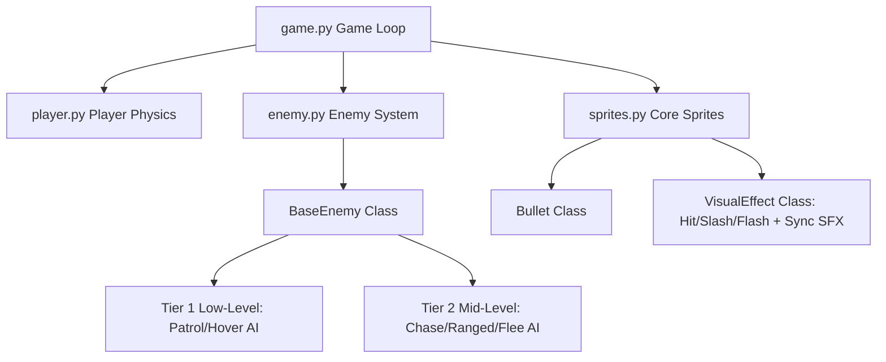
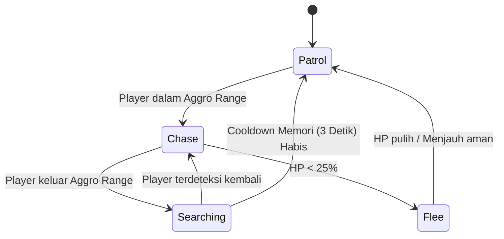

# Rencana Implementasi Mekanik Game & Animasi (Revisi Final)
Dokumen ini telah direvisi secara komprehensif berdasarkan umpan balik teknis terkait penamaan file, optimasi kinerja tabrakan, sinkronisasi audio, logika transisi AI Tier 2, dan pembersihan memori efek visual.

Dokumen ini menjadi panduan kerja terpadu untuk merancang aset peta, efek combat, audio, dan pemrograman animasi.

---

## 1. Arsitektur Kelas Modular
Struktur kelas diatur secara hierarkis untuk mendukung modularitas kombat dan kecerdasan musuh bertingkat:



---

## 2. Detail Mekanisme Game Hasil Pembaruan

### A. AI Musuh Bertingkat dengan Logika Transisi & Sensor Batas ([enemy.py](file:///mnt/c/Users/ASUS/Documents/python/project_akhir_pbo/src/enemy.py))

Sistem AI dibagi menjadi dua tingkatan dengan aturan transisi dan sensor batas fisik yang ketat:

#### 1. Tier 1: Low-Level Enemies (Musuh Tingkat Bawah)
Perilaku mekanis sederhana tanpa melacak koordinat dinamis pemain secara langsung:
*   **Patrol Terbatas (Bounded Patrol)**: Bergerak horizontal di atas tanah dalam batas kotak area (`main_rectangle`). Saat mencapai batas area, ia membalikkan arah dan me-render ulang frame visual yang dibalik secara horizontal.
*   **Melayang Sinus (Sinusoidal Hover)**: Meluncur horizontal sambil berayun naik-turun menggunakan gelombang sinus (`math.sin`) yang dipengaruhi parameter amplitudo dan frekuensi acak.

#### 2. Tier 2: Smart Enemies (Musuh Tingkat Menengah)
Mengadopsi mesin state (*state machine*) dengan memori pelacakan dan sensor navigasi tebing:


*   **Logika Memori Pelacakan (Alert Memory Timer)**:
    *   Jika pemain terdeteksi berada di dalam *Aggro Range*, musuh masuk ke **Chase State**.
    *   Jika pemain kabur keluar dari *Aggro Range*, musuh **tidak langsung lupa**. AI masuk ke **Searching State** selama 3 detik menggunakan `Timer`. Selama durasi ini, musuh akan mematangkan patroli di sekitar lokasi terakhir pemain berada. Jika setelah 3 detik pemain tidak ditemukan, musuh kembali ke **Patrol State** biasa.
*   **State Melarikan Diri & Sensor Tebing (Flee Boundary Safety)**:
    *   Saat HP musuh < 25%, ia masuk ke **Flee State** (berlari berlawanan arah dari koordinat horizontal pemain).
    *   **Sensor Batas Fisik**: Untuk mencegah musuh tersangkut di ujung tebing atau menabrak dinding saat melarikan diri, dipasang *virtual ahead-sensor* (sebuah titik rekaan 32 piksel di depan bawah arah jalannya). Jika sensor ini mendeteksi tidak ada rintangan tanah di bawahnya (ujung tebing) atau mendeteksi tabrakan dinding horizontal depan, AI diprogram untuk langsung membalikkan arah lari atau bertukar ke posisi bertahan (**Defensive State**).

---

### B. Optimasi Kinerja: Filter Tabrakan Dua Fase (Two-Phase Collision Filtering)
Mengeksekusi pendeteksian tabrakan *Pixel-Perfect* (`pygame.sprite.collide_mask`) langsung pada setiap frame dapat menurunkan frame rate (FPS) game secara drastis saat terdapat banyak entitas. Untuk mengatasinya, diimplementasikan optimasi penyaringan tabrakan 2 tahap:

1.  **Fase 1: Bounding Box Filter (Cepat)**:
    *   Pemeriksaan awal menggunakan tabrakan area kotak biasa (`pygame.Rect.colliderect` atau `pygame.sprite.spritecollide` biasa) yang diproses sangat cepat oleh mesin Pygame berbasis bahasa C.
2.  **Fase 2: Mask Verification (Akurat)**:
    *   Hanya jika fase 1 mendeteksi adanya tumpang-tindih kotak (overlap), fungsi `pygame.sprite.collide_mask` dijalankan untuk memverifikasi piksel non-transparan secara presisi.
    *   Jika tidak terjadi overlap pada kotak area, pemeriksaan mask diabaikan sepenuhnya pada frame tersebut.

---

### C. Generik Visual Effect & Sinkronisasi Audio ([sprites.py](file:///mnt/c/Users/ASUS/Documents/python/project_akhir_pbo/src/sprites.py))
Kelas `VisualEffect` digunakan untuk seluruh efek kombat (Muzzle Flash senjata, Hit Spark peluru, dan Sword Slash tebasan pedang) sekaligus bertindak sebagai pemicu audio (SFX) yang sinkron:

*   **Penyisipan Audio Sinkron (SFX Trigger)**:
    *   Saat inisialisasi kelas (`__init__`), selain memproses gambar efek, `VisualEffect` menerima argumen file suara (misal `sfx_name='impact'`).
    *   Di dalam `__init__`, efek langsung memanggil audio terkait untuk diputar:
        ```python
        if sfx_name and sfx_name in game_audio_dict:
            game_audio_dict[sfx_name].play()
        ```
    *   Hal ini memastikan suara kombat dan kilasan cahaya meledak pada milidetik yang sama secara akurat.
*   **Pembersihan Objek Memori (Garbage Collection)**:
    *   Ketika durasi efek visual (misal 150ms) telah terlewati, fungsi callback timer **wajib** memanggil `self.kill()`.
    *   Metode `self.kill()` akan secara otomatis menghapus sprite dari semua grup (`all_sprites`) dan melepas referensi objeknya. Hal ini memungkinkan Python Garbage Collector membersihkan memori secara berkala dan mencegah penumpukan sampah visual (*memory leaks*) akibat kombat yang intens.

---

## 3. Panduan Pengembang Besok Pagi

### A. Sistem Penamaan File Aset Animasi (Zero-Padding)
Hindari menamai frame file secara mentah (seperti `0.png`, `1.png`, `10.png`) karena pembaca direktori sistem operasi akan mengurutkannya secara alfabetis (`10.png` dibaca sebelum `2.png`). 

Gunakan sistem **Zero-Padding** dengan format minimal dua digit untuk menjamin urutan frame dibaca secara sempurna:
```text
assets/image/character/player/
├── 00.png   (Frame 1)
├── 01.png   (Frame 2)
├── 02.png   (Frame 3)
...
└── 10.png   (Frame 11)
```
*(Catatan: Fungsi loader di `support.py` kita saat ini telah dilengkapi dengan key casting integer `key=lambda p: int(p.stem)` sebagai pengaman tambahan di sisi kode).*

### B. Struktur Layering Desain di Tiled Map Editor
Pastikan nama layer berikut diatur dengan presisi saat menggambar peta:

| Nama Layer | Tipe Layer | Fungsi |
| :--- | :--- | :--- |
| **`ground`** | Tile Layer | Tanah padat berpijak (Kategori Tabrakan). |
| **`wood`** | Tile Layer | Jembatan atau platform kayu (Kategori Tabrakan). |
| **`decoration`** | Tile Layer | Rumput, bebatuan hiasan, karang latar belakang (Tanpa Tabrakan). |
| **`player`** | Object Layer | Objek tunggal penunjuk posisi awal spawn pemain. |
| **`exit`** | Object Layer | Area portal penanda selesainya level/stage. |
| **`enemy`** | Object Layer | Titik peletakan koordinat patroli musuh. |
