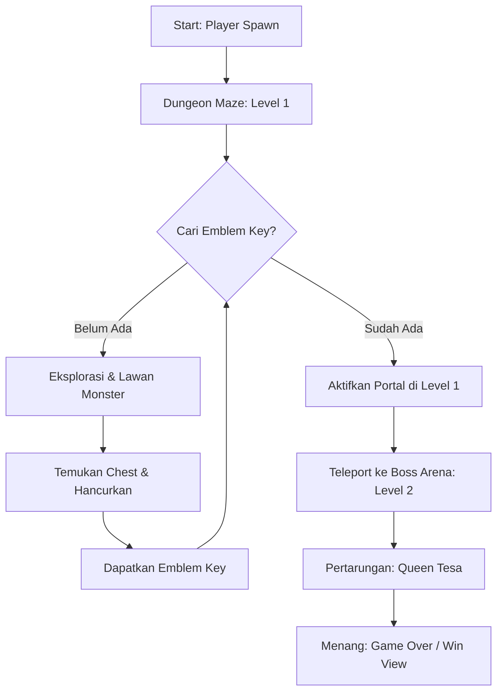

# Rancangan Map Dungeon (Tiled Map Editor & Python Arcade)

Dokumen ini berisi spesifikasi teknis dan desain layout peta (map) untuk game Action RPG menggunakan software **Tiled Map Editor** (`.tmx`).

---

## 1. Spesifikasi Teknis Map

*   **Format File**: `.tmx` (XML) hasil ekspor dari Tiled Map Editor.
*   **Ukuran Tile**: 16x16 piksel (Sesuai dengan gaya *low-quality pixel art* retro).
*   **Dimensi Map**:
    *   **Level 1 (Dungeon Maze)**: 60x60 tiles (960x960 piksel).
    *   **Level 2 (Boss Arena)**: 32x32 tiles (512x512 piksel).

---

## 2. Struktur Layer Map di Tiled

Saat membuat peta di Tiled, gunakan nama layer berikut agar pembacaan di kode program (`arcade.tilemap.load_tilemap`) berjalan sinkron:

1.  **`Ground`** (Tile Layer - Background):
    *   Berisi tile lantai batu dungeon, tanah retak, atau karpet hiasan.
    *   *Sifat*: Tidak memiliki collider (pemain bisa berjalan di atasnya).
2.  **`Walls`** (Tile Layer - Obstacles):
    *   Berisi dinding dungeon, pilar besar, jurang, dan jeruji besi.
    *   *Sifat*: Memiliki property `collision = True` agar dibaca oleh Physics Engine Arcade untuk mencegah pemain/musuh menembus dinding.
3.  **`Details`** (Tile Layer - Kosmetik):
    *   Berisi rantai gantung di dinding, genangan air, debu, obor tempel.
    *   *Sifat*: Berada di atas layer Ground/Walls sebagai pemanis visual tanpa tabrakan.
4.  **`Objects`** (Object Layer - Logika Game):
    *   Menggunakan koordinat titik untuk menentukan lokasi entitas:
        *   `PlayerSpawn`: Titik awal kemunculan Swordman.
        *   `QueenTesaSpawn`: Titik spawn Bos Utama (hanya di Level 2).
        *   `Portal`: Pintu masuk/portal menuju arena boss yang terkunci oleh *Emblem Key*.
    *   Menentukan lokasi penempatan Peti Hancur (`Chests`) dan titik patroli musuh (`Slime`, `Skeleton`, `Ghost`).

---

## 3. Alur Eksplorasi Map



---

## 4. Layout Visual & Desain Level

### Level 1: Dungeon Maze (Teka-Teki & Eksplorasi)
*   **Suasana**: Gelap gulita (sangat mengandalkan lingkaran cahaya pemain).
*   **Desain Ruangan**:
    *   Terdiri dari lorong-lorong sempit berliku yang dijaga oleh *Slime* dan *Skeleton Warrior*.
    *   Beberapa ruangan buntu berisi peti kayu (`Chests`). Salah satu peti tersebut secara acak berisi **Emblem Key** (Kunci Portal).
    *   Di tengah map, terdapat sebuah struktur portal kuno yang dikelilingi obor mati. Portal ini baru akan menyala jika pemain mendekat sambil membawa *Emblem Key*.

### Level 2: Boss Arena (Queen Tesa Chamber)
*   **Suasana**: Lebih terang tetapi mencekam (dikelilingi obor berwarna ungu tua/merah).
*   **Desain Ruangan**:
    *   Berbentuk lingkaran atau persegi besar yang lapang (32x32 tiles) tanpa rintangan di tengahnya agar pemain memiliki ruang yang cukup untuk melakukan *Dodge Dash* menghindari hujan peluru Queen Tesa di Fase 1.
    *   Di sekeliling arena terdapat dinding batu pembatas yang tidak dapat dilewati.

---

## 5. Implementasi Kode di Python Arcade

Untuk memuat peta ini di kode utama, kita akan menggunakan fungsi bawaan Arcade seperti berikut:

```python
# Memuat map Tiled
tile_map = arcade.tilemap.load_tilemap(
    "assets/maps/dungeon_level1.tmx", 
    scaling=2.0, 
    use_spatial_hash={"Walls": True} # Mempercepat deteksi tabrakan dinding
)

# Membuat scene
scene = arcade.Scene.from_tilemap(tile_map)

# Mendapatkan list tembok untuk Physics Engine
physics_engine = arcade.PhysicsEngineSimple(
    player_sprite, 
    walls=scene["Walls"]
)
```

---

## 6. Desain Easter Eggs pada Map

Untuk membuat game terasa lebih seru dan interaktif (cocok untuk nilai tambah tugas akhir), berikut adalah beberapa cara menerapkan Easter Eggs menggunakan kombinasi **Tiled Map Editor** dan kode **Python Arcade**:

### A. Dinding Rahasia & Saluran Pembuangan (False Wall & Sewage Drain Easter Egg)
*   **Konsep**: Lorong rahasia di mana pemain bisa berjalan menembus dinding batu tertentu untuk memasuki sebuah ruangan tersembunyi berwujud kotak. Di dalam ruangan tersebut terdapat objek lubang pembuangan (*sewage drain*) kotak. Jika pemain berdiri di dekatnya dan menekan tombol `J`, karakter akan memunculkan gelembung balon dialog berisi ucapan satir: *"seseorang pernah masuk ke dalam sini, tapi aneh nya sekarang dia menjadi orang penting di pemerintahan"*.
*   **Cara Membuat di Tiled**:
    1. Buat layer tile baru bernama **`SecretWalls`** (tanpa tabrakan) untuk menutupi pintu masuk ruangan rahasia.
    2. Gambar ruangan berbentuk kotak kecil di balik dinding tersebut menggunakan layer `Ground` dan `Walls`.
    3. Di layer **`Objects`**, letakkan sebuah objek bertipe *Trigger* tepat pada posisi tile lubang pembuangan, berikan nama objek tersebut: **`SewageDrain`**.
*   **Logika di Kode**:
    * Pemain bisa berjalan menembus `SecretWalls` untuk masuk ke ruangan rahasia.
    * Ketika pemain berada dalam radius dekat dengan koordinat `SewageDrain` dan menekan tombol `J`, aktifkan variabel state `dialogue_active = True` dan isi teks percakapan dengan kalimat yang diinginkan.
    * Gambar kotak teks/balon dialog di atas kepala karakter menggunakan `arcade.draw_text` dan `arcade.draw_rectangle_filled` untuk mensimulasikan gaya komik.

### B. Ruangan Rahasia Developer (Dev Room)
*   **Konsep**: Sebuah ruangan kecil terisolasi di pojok peta yang tidak memiliki pintu masuk normal.
*   **Cara Membuat**:
    1. Di Tiled, buat ruangan tertutup rapat di ujung peta.
    2. Letakkan sebuah objek di layer `Objects` bernama **`DevRoomTeleport`** di dalam ruangan tersebut, dan objek **`SecretTrigger`** (misalnya berupa sprite patung aneh atau lukisan di dinding utama).
    3. Ketika pemain berinteraksi dengan `SecretTrigger` (misal memukul patung tersebut sebanyak 3 kali), pemain akan diteleportasi secara instan ke koordinat `DevRoomTeleport`.
    4. Di dalam ruangan ini, Anda bisa menuliskan pesan khusus (seperti *"Terima kasih telah bermain! Dibuat oleh [Nama Anda] untuk Tugas Akhir Semester 2"* menggunakan sprite teks).

### C. Item Drop Langka & Rahasia (Contoh: "Crown of Dev")
*   **Konsep**: Hancurkan peti tertentu yang terletak di tempat yang tidak masuk akal (misal di balik kegelapan luar batas peta) untuk mendapatkan item kosmetik rahasia yang memberikan peningkatan kecepatan sangat tinggi secara permanen.

